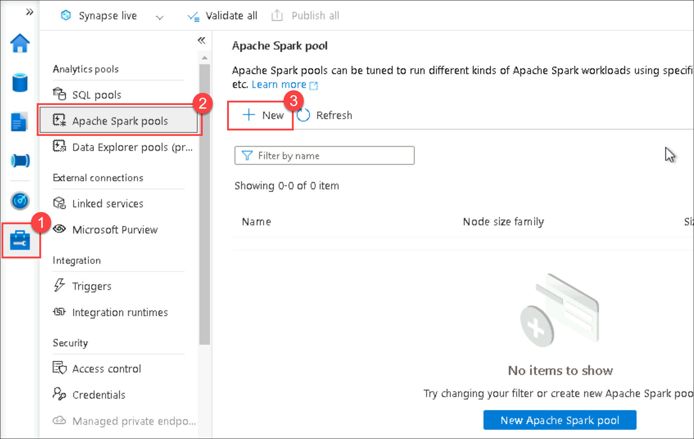
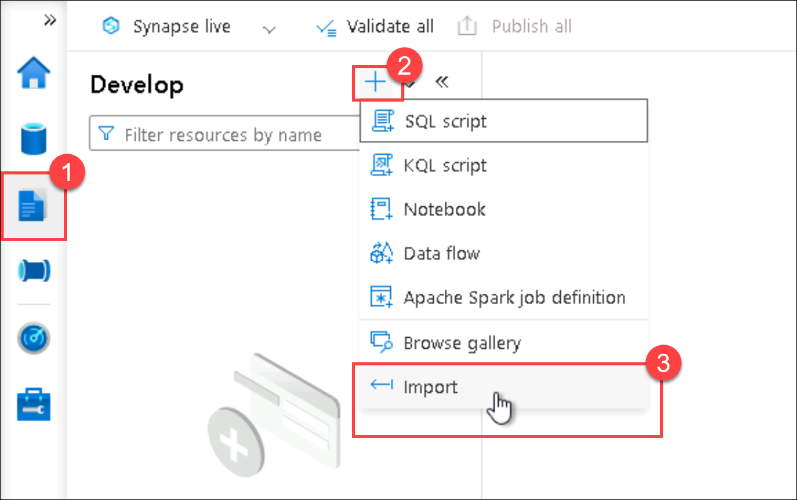
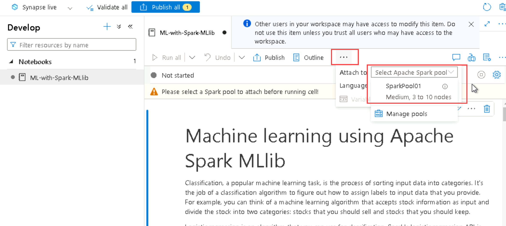

# Machine learning using Apache Spark MLlib lab

Classification, a popular machine learning task, is the process of sorting input data into categories. It's the job of a classification algorithm to figure out how to assign labels to input data that you provide. For example, you can think of a machine learning algorithm that accepts stock information as input and divide the stock into two categories: stocks that you should sell and stocks that you should keep.

Logistic regression is an algorithm that you can use for classification. Spark's logistic regression API is useful for binary classification, or classifying input data into one of two groups. For more information about logistic regression, see [Wikipedia](https://en.wikipedia.org/wiki/Logistic_regression).

In summary, the process of logistic regression produces a logistic function that you can use to predict the probability that an input vector belongs in one group or the other.

## Lab environment setup

> This lab is designed to be run on the Lab 9 environment (_Load Data into a Relational Data Warehouse_) at the conclusion of the its lab instructions.

1. Within Synapse Studio, select **Manage** in the left-hand menu, then select **Apache Spark pools**. Next, select **+ New** to create a new Apache Spark pool.

    

2. Enter the following in the form:

    - **Apache Spark pool name**: `SparkPool01` (or some other name)
    - **Node size family**: `Memory Optimized`
    - **Node size**: `Medium (8 cores / 64 GB)`
    - **Autoscale**: `Enabled`
    - **Number of nodes**: `3`
    - **Dynamically allocate executors**: `Disabled`

3. Select **Review + create**, then **Review** to create the spark pool.

4. Open the [ML-with-Spark-MLlib.ipynb](ML-with-Spark-MLlib.ipynb){:target="_blank"} notebook and select the **Download raw file** option to save it to your desktop on the lab VM.

5. In Synapse Studio, select **Develop** in the left-hand menu, select the **+** button at the top, then select **Import** to browse to the downloaded notebook.

    

6. At the top of the imported notebook, select the Apache Spark pool you created and execute each cell of the notebook. Feel free to read the associated learning material to learn more about each step.

    
